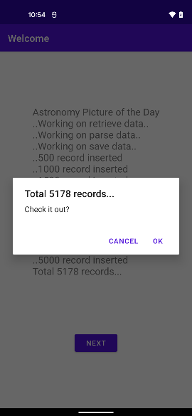
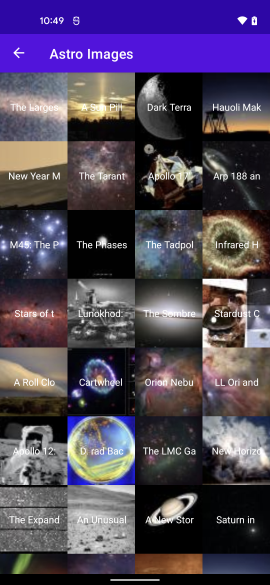
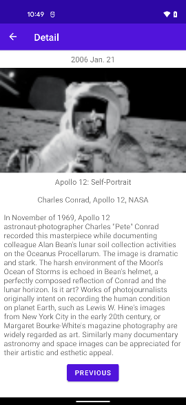

# AstroViews
> For CMoney Interview Use

# Requirement:
## 目標檔案位址：https://raw.githubusercontent.com/cmmobile/NasaDataSet/main/apod.json
## 做出三個頁面
1. 第一個頁面只需要有一個 Button 換場到下一個頁面。
2. 第二個頁面要把 API 的內容呈現，需要呈現的項目有兩個, 分別是
“title”、“url”，title 是 String, url 是圖案的網址, 要在 cell 內的 imageView 中呈現, 每一橫列放四個格子。
3. 第三個頁面是點擊了第二個頁面後的任一格, 推入下一頁, 要呈現當格的背景圖(hdurl)、date、title、copyright 和description，date格式為 2020 Dec. 17頁面要能滑動, 以看到完整的內容。
4. UI 要能自動適應各尺寸大小的螢幕
5. 實作請使用 kotlin
6. 禁止使用第三方套件
例如:
- Glide(com.github.bumptech.glide)
- OKHttp(com.squareup.okhttp3)
- Retrofit(com.squareup.retrofit2)
- Picasso(com.squareup.picasso)
7. 可以使用的library
- andriod或androidx等官方library
- kotlin coroutine
- Gson、Moshi等Json套件，當然最好使用原生JsonArray和JsonObject．

# Solution:
## First Page

1. Retrieving json from URL as String and parse it with `Gson` and `coroutine`.
2. Read through **5,178 records** and write them into `SQLite` table.
3. Keep posting process state to UI with `LiveData` and guide user navigate to GridView page.

## GridView page

1. Images saved in SQLite table will be read as `paged` data into RecyclerView with Paging Library 3.
2. Clicking any image will take user to `detail page`

## Detail Page

1. Image clicked by user will be send to this page via Parcelable to populate onto UI.
2. Navigating back you can choose other images.

## Archived json file
- ./apod.json